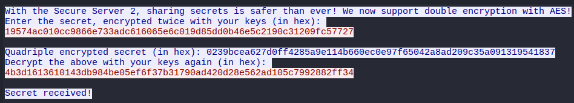
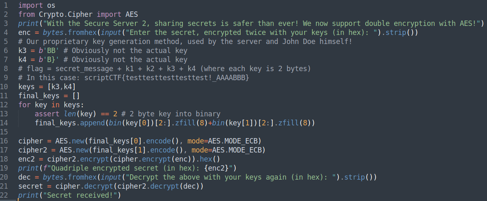
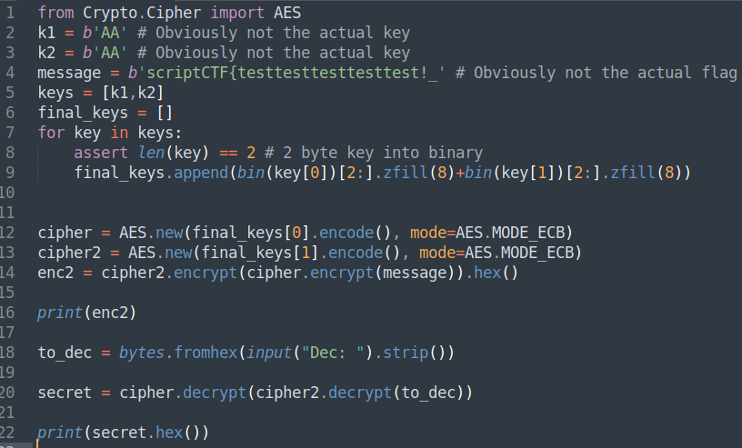

# Secure-Server-2
**Category:** Crypto  
**Points:** Dynamic  
**CTF:** ScriptCTF 2025  
**Author:** ChickenJockey64

---

## 🧠 Challenge Description

> John Doe uses this secure server where plaintext is never shared. Our Forensics Analyst was able to capture this traffic and the source code for the server. Can you recover John Doe's secrets?

---

## 🗂️ Files Provided

- `files.zip`
	- `capture.pcap`
	- `johndoe.py`
	- `server.py`

---

## 🧠 Solution Strategy
We get `capture.pcap`, `server.py` and `johndoe.py` from unzipping the folder. I start by checking the `capture.pcap` file in Wireshark and follow the TCP stream like in the previous ``Secure-Server`` challenge: 



Looks like a conversation between a user and the `server.py` and we can confirm this by looking at the `server.py` script: 



So from the `capture.pcap` and `server.py` it looks similar to the previous challenge in that the user this time encrypts the secret twice and then gives it as input. Then the server double encrypts it again with their key. In the last message the user decrypts the quadruple encrypted secret with the user's keys. Also the `server.py` file states that the flag is the following: 

`# flag = secret_message + k1 + k2 + k3 + k4 (where each key is 2 bytes)
`# In this case: scriptCTF{testtesttesttesttest!_AAAABBB}``

Therefore, we need to find the keys and secret message to get the flag. Now let's look at `johndoe.py`:



The code picks 2-byte keys `(k1, k2)` and a message. It then turns the 2-byte keys into 16-byte ASCII bitstrings and encrypts the message twice using these bitstrings. Then later when the server sends a message back it decrypts it twice and sends it to the server. So overall just to get a overview of everything this is what is happening from the start:

- `User = E_k2(E_k1(S))`
- `Quadruple = E_k4(E_k3(User))`
- `UserReply = D_k1(D_k2(Quadruple))` ⇔ `Quadruple = E_k2(E_k1(UserReply))`

The user encrypts twice the secret with key `k1` and `k2`, the server then responds with it encoded with the servers keys `k3` and `k4`. The user then responds with the server response decrypted twice with `k1` and `k2`. So the way we can exploit this is using a man in the middle attack. Here we use the fact that both the user and the server apply two layers of AES-ECB with very short keys (2 bytes each → expanded to 16 bytes of `'0'/'1'` chars): 

- Compute all possible `E_k1(UserReply)` values for all k1.
- Compute all possible `D_k2(Quadruple)` values for all k2.
- If there’s a match, `(k1,k2)` is a valid pair.

We can repeat the same trick for `(k3,k4)` using the relation between `User` and `Quadruple`. This can be implemented with a short Python brute-forcer. This gives us our final flag: 

```bash
scriptCTF{s3cr37_m3ss4g3_1337!_7e4b3f8d}
```
