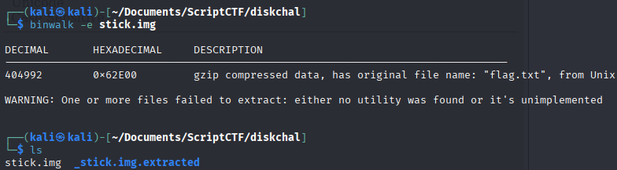

**Category:** Forensics  
**Points:** Dynamic  
**CTF:** ScriptCTF 2025  
**Author:** ChickenJockey64

---

## 🧠 Challenge Description

> i accidentally vanished my flag, can u find it for me

---

## 🗂️ Files Provided

- `stick.img`

---

## 🧠 Solution Strategy

We're given a file `stick.img` and we're tasked with finding a vanished flag. We first start by checking what kind of file it is with `file`:

![[image.png]]

It seems to be a FAT32 volume, so we start off by mounting it and trying to read from it: 

![[image-3.png]]

This gives us two files and upon reading them we get the hint that it might be some hidden or embedded file:

![[image-4.png]]

So the next thing we try is to Binwalk and check for embedded files: 

![[image-5.png]]

We find gunzip compressed data, and to extract this we can use Binwalk to get the embedded files in a new folder:



Inside this folder we find the `flag.txt` folder with the flag: 

```bash
scriptCTF{1_l0v3_m461c_7r1ck5}
```

